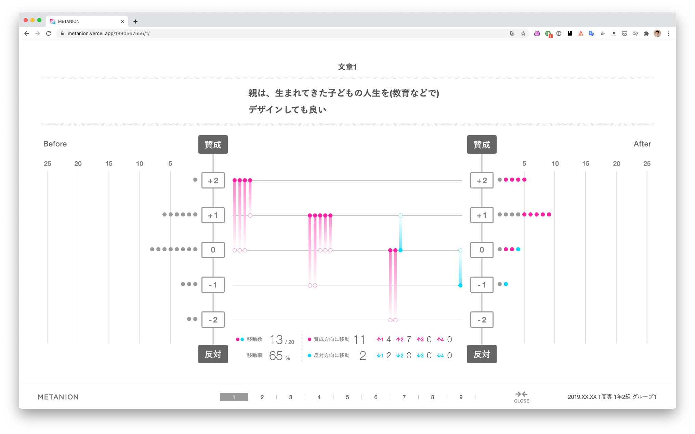

# METANION

賛成反対ビジュアライザー METANION



表示画面サイズ： 1920 ✕ 1080 px 以上

## Build Setup

```bash
# install dependencies
yarn install

# serve with hot reload at localhost:3000
yarn dev

# build for production and launch server
yarn build
yarn start

# If you like to see from other devices on LAN network
nuxt --hostname '192.168.0.106' --port 3000

# generate static project
yarn generate
```

For detailed explanation on how things work, check out [Nuxt.js docs](https://nuxtjs.org).


# Spreadsheet側で必要な作業

1. IDの取得 → `.env`へ反映 `SPREADSHEET_ID='xxxxx'`
2. keyの取得 → `.env`へ反映 `API_KEY='xxxxx'`
3. ファイル ＞ ウェブに公開
4. 共有設定 ＞ このリンクを知っているインターネット上の全員が閲覧できます

Ref: https://www.freecodecamp.org/news/cjn-google-sheets-as-json-endpoint/
